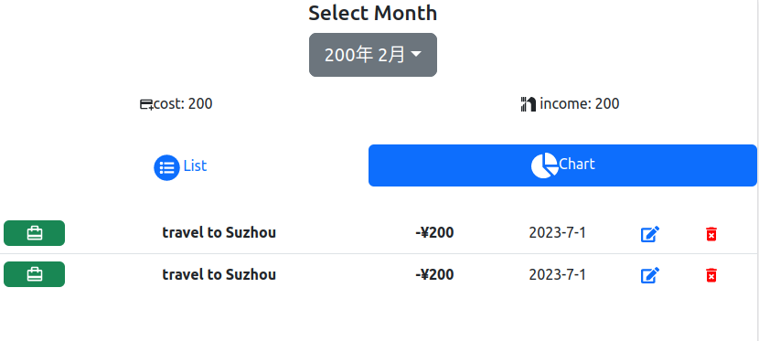

# 记账Web App
## 技术选型

* React工具
    * ionicon
    * Reactouter
    * Recharts
    * Bootstrap
* 测试和工具
    * Jest
    * EnzyMe
    * JSONServer
    * Axios

## From UI to FrontEnd

* 分析原型图
    * 总体结构
        * 首页（含有列表和图表两个视图）
            * 分列表模式和图表模式
            * 可新建条目和编辑条目
        * 新建页（编辑账目）
    * 首页

```
---------------------------------------------
                    记账
选择月份(dropDownList)      收入:xxx 支出:xxx
---------------------------------------------
| list model       |     |   graph model    |
---------------------------------------------
                 新建记账记录
---------------------------------------------
|icon| thing       | cost |date |edit|delete|
---------------------------------------------
.......
---------------------------------------------


首页功能点分析：
1. 显示当前年月（下拉框点击月份可以切换）
2. 统计本月的收入和支出综合
3. 点击Tab切换不同视图（列表和图表）
4. 点击新建可以跳转到新建页面
5. 显示条目包括分裂图标，事件（主题），花费，日期，编辑和删除按钮
6. 点击编辑按钮会跳转到编辑页面（可与新建页共）
```  


   * 创建页
```
|        支出    |     收入      |
分类图标...
title: input框
cost:  input框
date:  input框

|submit|cancel|

功能分析：
1. 点击提交按钮，如果验证位通过显示提示，如果通过跳转首页
2. 点击取消按钮，直接跳转到首页
```

* 创建工程
    * creat-react-app创建模板
    
## 规范
* 组件分类
    * 展示型组件
        * 仅通过prop接受数据
    * 容器型组件
        * 更关注数据
        * 为前者提供数据和回调函数
    * 呈现目录
```
myapp
    -public
    -node_modules
    -src
        -components
            -ComponentName.js
            -__test__
                -ComponentName.test.js
        -containers
            -ComponentName.js
            -__test__
                -ComponentName.test.js
        App.js
        App.css
        index.js
        index.css
        logo.svg
        ...    
```        
* 命名规范
    * 自定义组件每个单词首字母都大写

## 拆分首页组件
* 拆分首页的展示型组件
    * 拆分组件:
        * monthSelect
        * totalNumber
        * viewTab
        * CreateButton
        * priceList(priceItem)
### PriceList组件  
* 分析组件属性
    * items(需要渲染的信息)
    * onDeleteItem(删除时执行的回调)
    * onEditItem(编辑时执行的回调
* 暂定传入的数据结构
```
[
    {
        "id": 1,
        "title": "去苏州旅游",
        "price": 200,
        "date": "2023-7-8",
        "
        "category":{
            "id": 1,
            "name": "旅游",
            "type": "outcome",
        }
    }
]
```

### 图标库
* free:
    * iconmoon
    * ionicons
* 使用
    * npm install react-ionicons@2.1.6 --save
    * 这里我们使用的是react-icons
    * npm install @react-icons/all-files
### 类型检查
* React内置：
    * PropTypes(包括DefaultProps)
* TypeScript(此处不用)

### ViewTab组件
* 分析组件属性
    * activeTab: 用来指示当前哪个Tab高亮
    * onTabChange: 点击Tab时的回调
* 样式库
    * bootstrap: tab
* utility.js
    * 定义一些常量和常用函数
* 实现功能
    * 利用activeTab实现添加对应className使高度
    * 添加图标react-icons
    * 去除链接的click默认行为


### TotalCost组件
* 分析组件属性
    * income
    * outcome
    * 收入支出可以父组件计算完成

### MonthPicker组件
* 需求分析
    * 按钮显示传入年月,点击按钮可以展开和关闭菜单
    * 显示当前年前后4年和月份(1-12)
    * 传入年月,打开菜单后对应年月应该高亮
    * 点击不同年可以切换,点击月份callback
* 组件属性
    * year
    * month
    * onChange
* 分段开发
    * 创建按钮,显示对应年月
    * 创建下拉菜单,点击按钮可以显示,或者隐藏
    * 下拉菜单中显示两列,分别位年月信息
    * 给对应年月高亮
    * 添加点击年份和月份后的交互
* 原型图
```
selectMonth
-----------
year:month:
-----------
[menu]
year1   | month1
year2   | month2
year3   | month3
....   ,,,,
------------
```
* 样式库 
    * Bootstrap

* 截至目前主页静态的子组件完成后的效果图
